# Dealzup Assignment (PropBot -- A online property buying/selling web application)

A real-estate web application built with React, Firebase Authentication, and JSON Server.  
It provides property listings (sale & rent), a featured carousel, user authentication, and responsive UI aligned with the given Figma design.  
# Features
- Pixel-perfect UI (based on Figma design).  
- Firebase Authentication (Signup, Login, Logout).  
- Property data dynamically fetched from API.  
- Filter using country name and state name.(property-type was not in the API)  
- Responsive and mobile-friendly layout.  

# Tech Stack
Used React.js to demonstrate functional components and hooks.
Used react-router for seamless page navigation without full page reload.
Used Firebase authentication for signup and login.
Used tailwindcss and plain css both.
Used context-api and localstorage to store logged-in user state so that the user stays logged in even after a page refresh and logs out the the user clicks on the logout button.
Used primeReact library for pagination.
Used .env to create environment variables in order to maintain data integrity.

- Newsletter subscription form.  
# Setup Instructions
git clone https://github.com/alamehtab/Dealzup_Assignment.git
cd Dealzup_Assignment
npm install / npm i --- to install dependencies and node modules
npm run dev --- to run production server

# Firebase Setup
1. Create a Firebase Project
   Go to [Firebase Console](https://console.firebase.google.com/).
   Click Add Project and give it a name (e.g., `my-app`).
   Enable Google Analytics only if you need it.

2. Register Your App
   Inside your Firebase project, go to Project Overview → Add app.
   Choose Web (`</>` icon).
   Give your app a nickname and register it.

3. Get Firebase Config
   After registering, Firebase will show you a config object like this:

     const firebaseConfig = {
       apiKey: "YOUR_API_KEY",
       authDomain: "YOUR_PROJECT_ID.firebaseapp.com",
       projectId: "YOUR_PROJECT_ID",
       storageBucket: "YOUR_PROJECT_ID.appspot.com",
       messagingSenderId: "YOUR_SENDER_ID",
       appId: "YOUR_APP_ID"
     };

4. Add Config to Project
   Create a file:  
   src/services/firebase.js
   Paste your config:

     import { initializeApp } from "firebase/app";
     import { getAuth } from "firebase/auth";

     const firebaseConfig = {
       apiKey: "YOUR_API_KEY",
       authDomain: "YOUR_PROJECT_ID.firebaseapp.com",
       projectId: "YOUR_PROJECT_ID",
       storageBucket: "YOUR_PROJECT_ID.appspot.com",
       messagingSenderId: "YOUR_SENDER_ID",
       appId: "YOUR_APP_ID"
     };

     const app = initializeApp(firebaseConfig);
     export const auth = getAuth(app);

5. Enable Authentication
   In Firebase Console → Authentication → Get Started
   Enable the providers you need (e.g., Email/Password).

6. Run the App
   npm install
   npm start

# Requirements and Steps Taken:
---- Home Page ----
Created a home page with a navbar and hero section with banner on the top of the page.
Created 'What to do' section with 4 property card fetched from the API with carousal.
Created a featured property section which is also fetched by from the API.
Created a newsletter subscription section.
Created a footer.
Created the application fully responsive in all screens.

---- Property Listing Page ----
Created another page and used react-router seamless page navigation and fetched the data from the API dynamically and used primeReact library for pagination.
Note: Filter by rent/sale needs a property type from the API which was not available.Therefore, I have created a search bar which can filetr properties by country and state.

---- Signup Page ----
Created a signup form with name, email, password and confirm password and used context to save user data.
Used Firebase authentication for successful signups and redirect to login page only when the operation succeeds.

---- Login Page ----
Used Firebase authentication to check userAuth and login only with correct credentials.
Stored user session with both React Context + localstorage and redirected user to home page only when the login succeeds

# Screenshots of the project
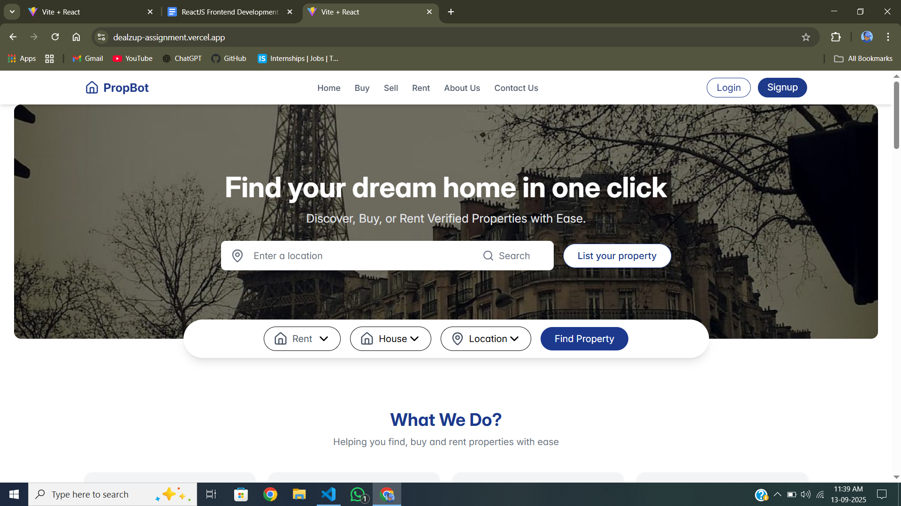
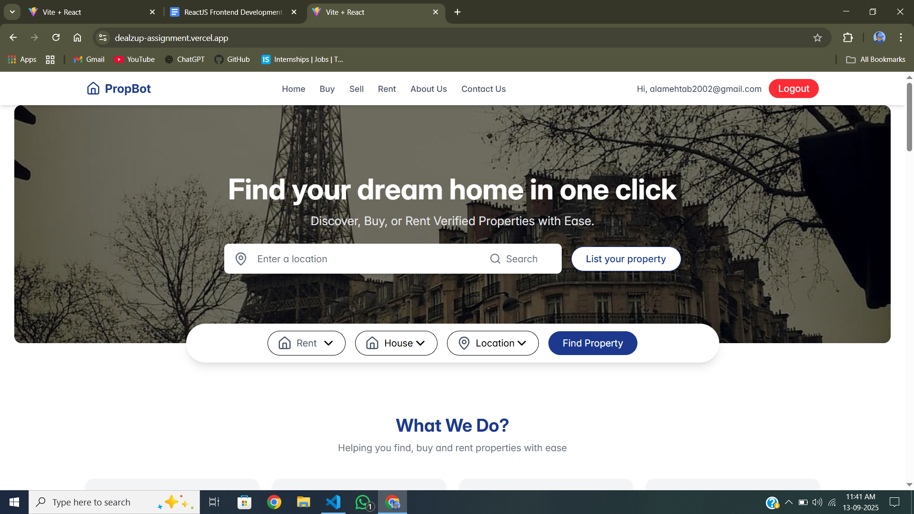
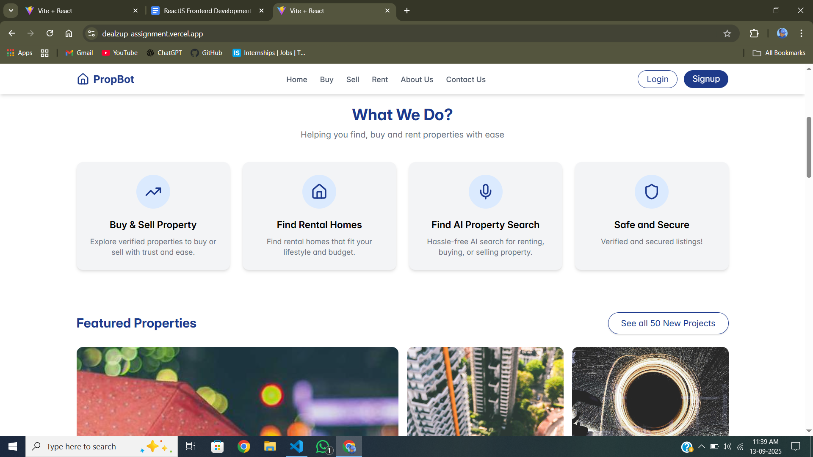
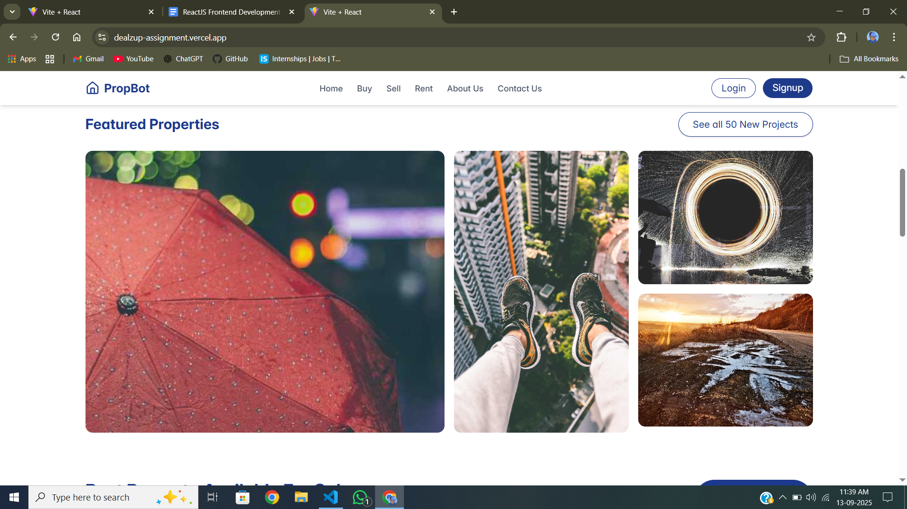
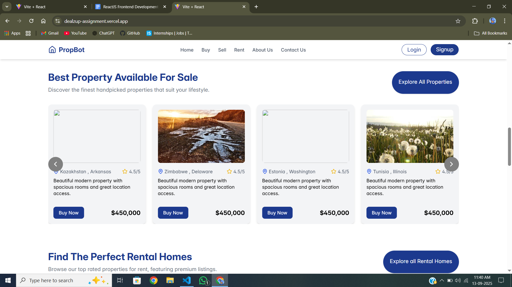
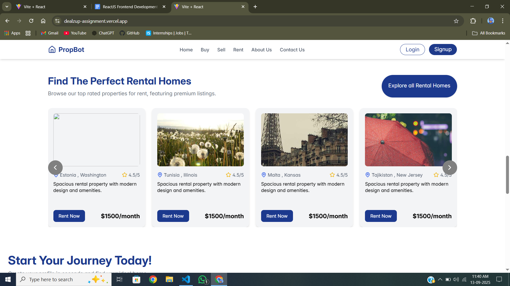
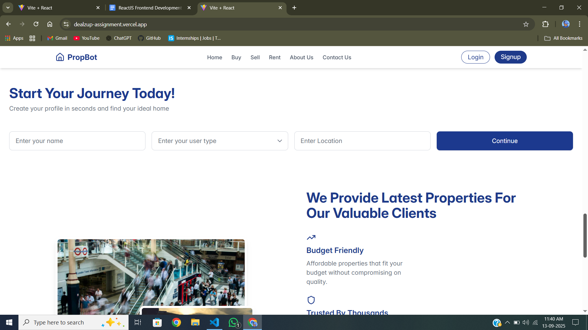
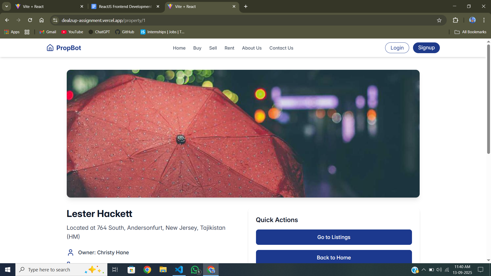
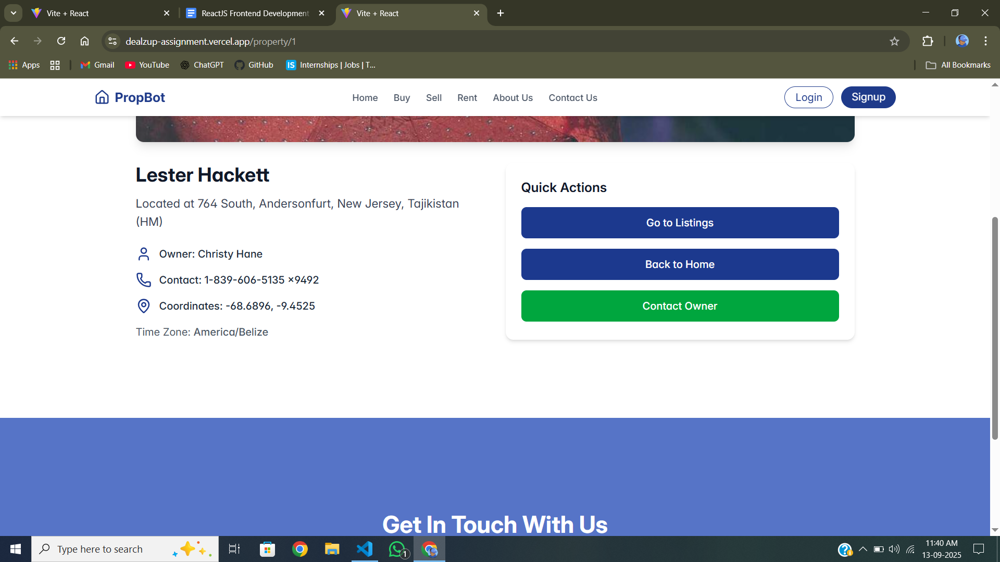
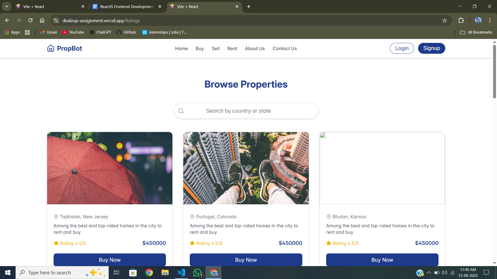
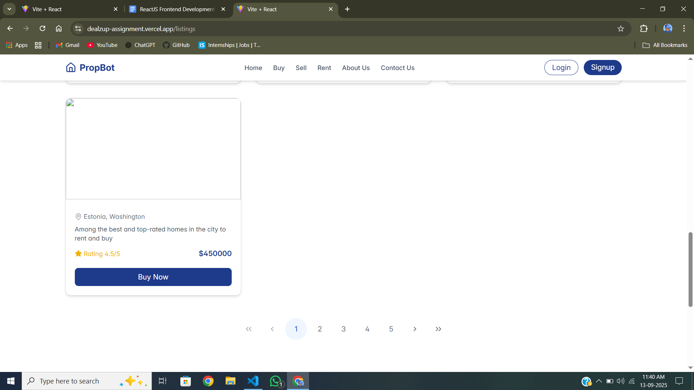
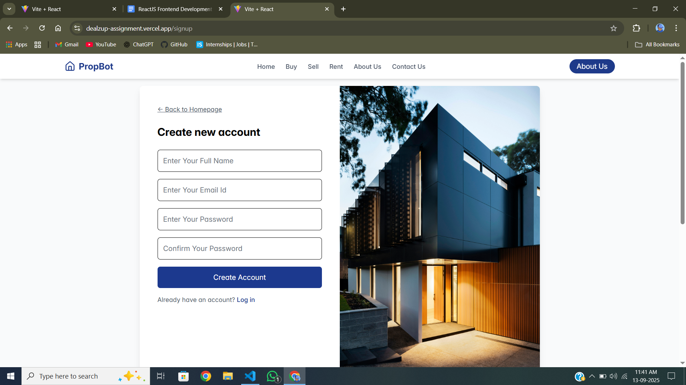
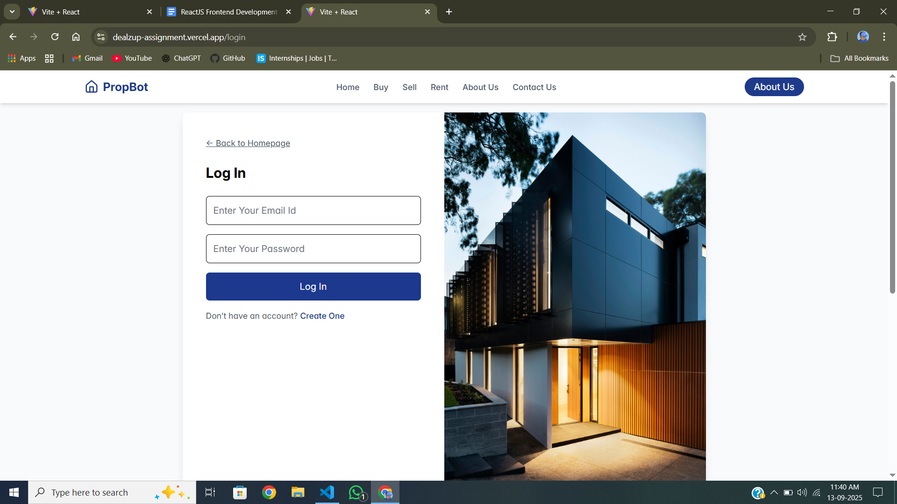
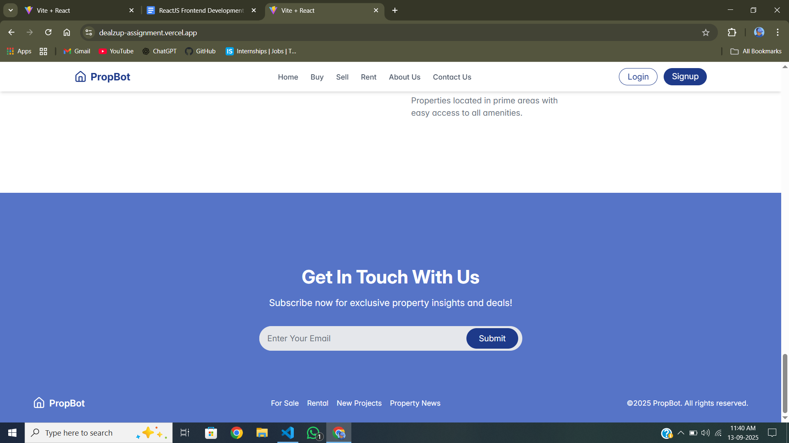